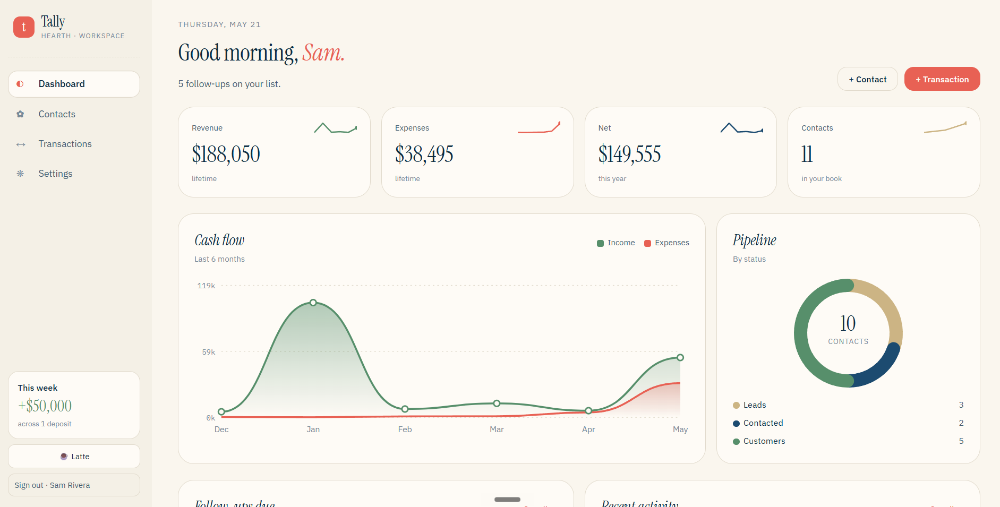
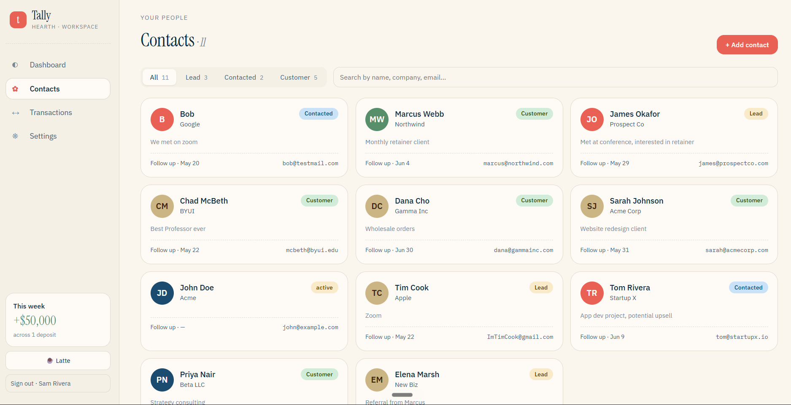
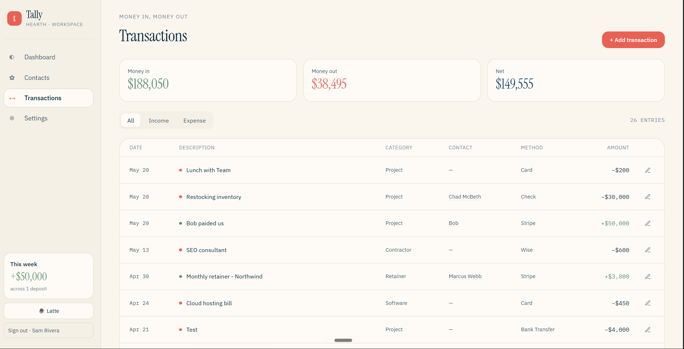

# Finance Dashboard — Live Demo

A browser-based CRM dashboard built with Python Flask and Google Firestore. Track contacts through a sales pipeline, log income and expenses, and view a live summary dashboard — all from the browser with no local database required.

> **This is a read-only demo.** The data is pre-seeded and writes are disabled so the demo stays clean for everyone. See the [full project](https://github.com/moffatluke/finance-dashboard) (private) for the complete source.

## Live Demo

🔗 **[finance-dashboard-demo.vercel.app](https://finance-dashboard-demo.vercel.app)**

Browse the dashboard, contacts, and transactions — everything loads from a real Firestore database. Add/edit/delete buttons are visible but writes are intentionally blocked.

## Features

- **Dashboard** — live summary of revenue, expenses, net income, and pipeline status
- **Contacts** — searchable contact book with pipeline status badges and follow-up dates
- **Transactions** — income/expense ledger with contact linking and category filtering

## Tech Stack

- **Backend** — Python 3.12, Flask 3.1
- **Database** — Google Firestore (Firebase)
- **Frontend** — Vanilla JS, HTML/CSS (no framework)
- **Hosting** — Vercel (serverless Flask via `vercel.json`)

## Screenshots

### Dashboard


---

### Contacts


---

### Transactions


---

## Architecture

```
Browser (HTML/JS)
      ↕  fetch() calls
Flask API (Python — Vercel serverless)
      ↕  Firestore SDK
Google Firestore (cloud database)
```

The frontend is plain HTML/JS served by Flask. All data flows through a centralized `api` client in `app.js` — no raw `fetch` scattered across pages.

A single `GET /api/dashboard` route aggregates both Firestore collections server-side and returns a ready-to-render summary in one request.

## Running Locally

```bash
git clone https://github.com/moffatluke/finance-dashboard-demo
cd finance-dashboard-demo
python -m venv venv && venv\Scripts\activate
pip install -r requirements.txt
```

Create a `.env` file:
```
GOOGLE_APPLICATION_CREDENTIALS=serviceAccount.json
```

Add your `serviceAccount.json` (Firebase Console → Project Settings → Service Accounts), then:
```bash
python app.py
```

Open `http://127.0.0.1:5000`.
